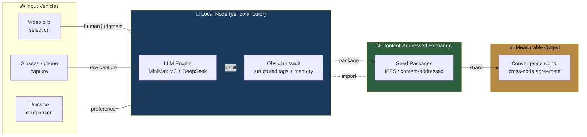

# Project Hive.AGI

**Exploring distributed human-perspective intelligence through structured judgment, local LLM processing, and content-addressed knowledge exchange.**

[](https://www.gnu.org/licenses/agpl-3.0)
[](https://creativecommons.org/licenses/by-nc-sa/4.0/)
[](https://github.com/CTO-goldmanglobal/gg-hiveagi/actions/workflows/ci.yml)
[](https://www.python.org/downloads/)

**[English](./README.md) | [繁體中文](./docs/zh-HK/README.md)**

---

## How it works



Each contributor runs a **private local node** (Obsidian vault + LLM engine) that processes their input into structured tags. Tags are packaged into **Seed Packages** and shared through **content-addressed exchange** (IPFS). When independent nodes produce similar judgments, that **convergence is measurable** — not views or likes, but independent human judgment agreement.

---

## 🎯 Vision

> Most AI systems today learn from data scraped from the internet. We are exploring a different foundation: structured human judgment — what people notice, value, and choose — as the primary signal for machine intelligence.

**Project Hive.AGI** is an open-source research initiative building a distributed human-perspective knowledge network. Rather than a single centralized model trained on aggregated data, the project envisions a network of independent local nodes — each processing human input through a private LLM engine and sharing structured knowledge through content-addressed exchange.

Anyone can use their own devices (glasses, phones, computers, industrial sensors) to contribute human-perspective data from their area of expertise. Through the LLM Wiki, this data is distilled into structured knowledge that can be exchanged, verified, and synthesized across the network.

📖 **[The Living Seed →](./docs/THE-LIVING-SEED.md)** — the full architecture document.

---

## 🚀 Quick Start

### 1. Clone & install

```bash
git clone https://github.com/CTO-goldmanglobal/gg-hiveagi.git
cd gg-hiveagi
python -m venv .venv && source .venv/bin/activate

pip install -r tools/seed_generator/requirements.txt
pip install -r llm_wiki_engine/requirements.txt
```

### 2. Generate a Seed Package (no API keys needed)

```bash
python tools/seed_generator/generate_seed.py
python tools/seed_generator/validate_seed.py --path seed_output/seed_goldman_20260725/
```

### 3. Run the LLM Wiki Engine (mock mode)

```bash
python -m llm_wiki_engine process \
    --inbox llm_wiki_engine/test_samples \
    --entries /tmp/test_entries \
    --mock
```

### 4. Share via IPFS (mock mode)

```bash
python -m p2p_exchange publish --package seed_output/seed_goldman_20260725/ --mock
```

For real-mode setup (MiniMax M3 + DeepSeek APIs), see [`llm_wiki_engine/.env.example`](./llm_wiki_engine/.env.example) and [`specs/api-protocol-v1.md`](./specs/api-protocol-v1.md).

---

## 🏗️ Architecture

| Layer | Module | What it does |
|:---|:---|:---|
| **Processing** | [`llm_wiki_engine/`](./llm_wiki_engine/) | Dual-LLM engine (MiniMax M3 generator + DeepSeek V4 Flash auditor). Converts raw input → structured Markdown entries. |
| **Memory** | Obsidian Vault | Local, private knowledge store. Each contributor owns their own. |
| **Exchange** | [`p2p_exchange/`](./p2p_exchange/) | IPFS/kubo content-addressed Seed Package exchange. Publish, verify, tamper-detect, resolve. |
| **Input** | [`videogen/clip_pool/`](./videogen/clip_pool/) | Video clip selection → human judgment → structured tags. First input vehicle. |
| **Safety** | [`tools/pii_anonymizer/`](./tools/pii_anonymizer/) | Face + license plate blur. Code-enforced, no bypass. |
| **Provenance** | [`videogen/provenance.py`](./videogen/provenance.py) | Separates stimulus provenance from judgment provenance. Stock stimuli blocked from research network. |

---

## 🧩 Roadmap

| Phase | Component | Status |
|:---|:---|:---|
| **P0** | Seed Package system + Obsidian vault setup | ✅ Complete |
| **P1** | LLM Wiki Engine (dual-LLM, mock + real verified) | ✅ Complete |
| **P2** | IPFS P2P exchange + Obsidian plugin | ✅ Complete |
| **Forge** | Video clip pool + judgment capture + finishing | ✅ Circle #1 complete |
| **Research** | Pairwise preference testing + convergence measurement | 🔬 Next |
| **Capture** | Glasses / phone first-person capture | 📋 Planned |

### Commercial modules (Goldman Forge)

Commercial product instances built on the research pipeline. Each solves a real client problem and generates structured human-perspective data.

| Module | Client | Status |
|:---|:---|:---|
| [ECH Auto-Cut](./explore_china_holiday/) | Explore China Holiday | ✅ MVP |
| [Clip Pool + Judge](./videogen/clip_pool/) | Explore China Holiday | ✅ Circle #1 |
| [Tour Video Finish](./.agents/skills/tour-video-finish/) | Explore China Holiday | ✅ Draft v1 |

---

## 📄 License

| Component | License |
|:---|:---|
| Code (Python, TypeScript, specs) | [AGPL-3.0](./LICENSE) |
| Seed Data (contributor knowledge packages) | [CC-BY-NC-SA-4.0](./DATA_LICENSE.md) |
| Commercial use | [Contact for license](./COMMERCIAL_LICENSE.md) |

---

## 🤝 Contributing

1. **Star & Fork** this repo
2. Read [CONTRIBUTING.md](./CONTRIBUTING.md) (includes CLA + PII rules)
3. Contribute a Seed Package or improve the code
4. Discussions welcome — see GitHub Issues

---

## 📬 Contact

- **Research collaboration & partnerships**: cto@goldmanglobal.com.au
- **Commercial licensing**: [COMMERCIAL_LICENSE.md](./COMMERCIAL_LICENSE.md)

---

## 🙏 Acknowledgements

Initiated by [Goldman Global Research Labs](https://goldmanglobal.com.au) — an open-source research initiative exploring how machines can learn human perspective through structured judgment, not centralized data scraping.

This project stands on the work of every contributor who tags, judges, and shares their perspective. That act — a human deciding what matters and why — is the irreducible unit this entire network is built from.

---

> Exploring whether machines can learn human perspective through structured judgment — not by scraping data, but by earning it one decision at a time.
