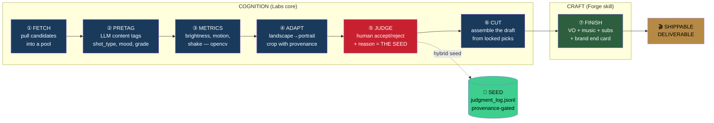
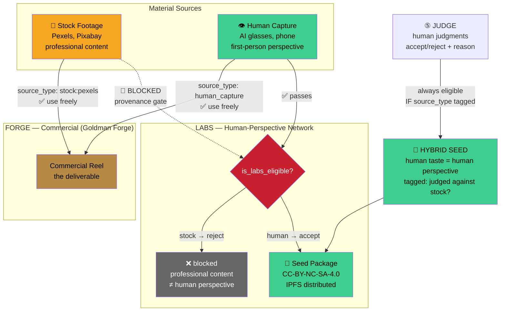
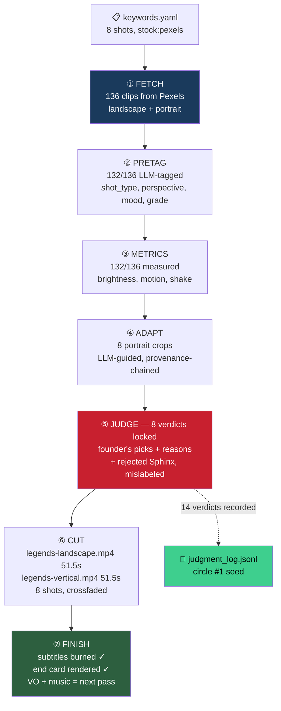
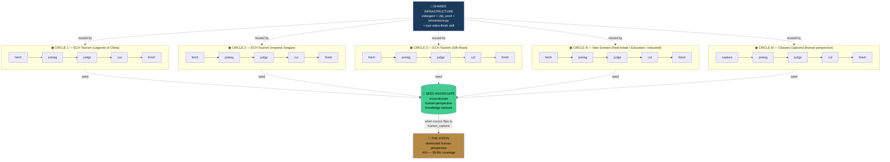
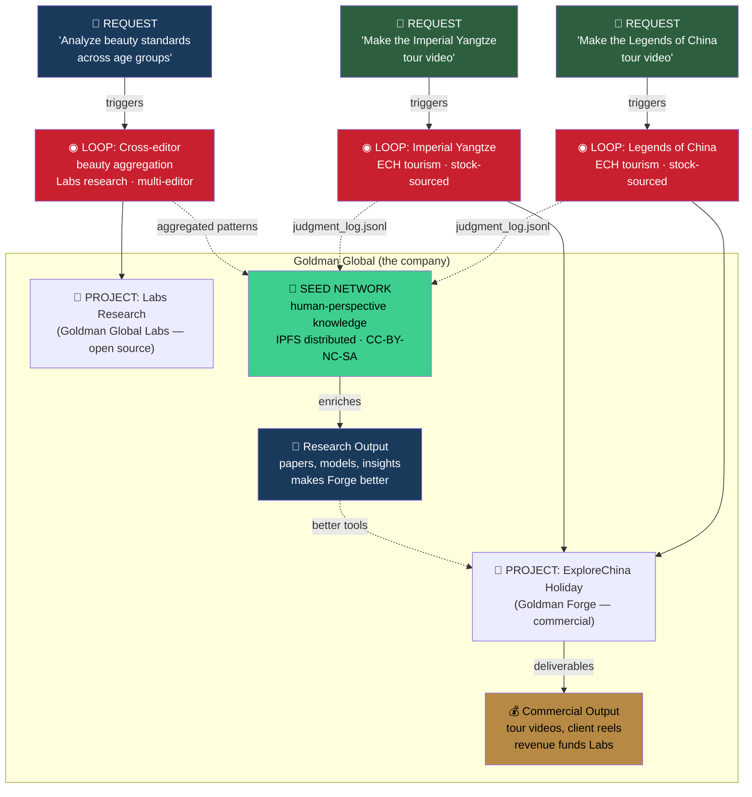
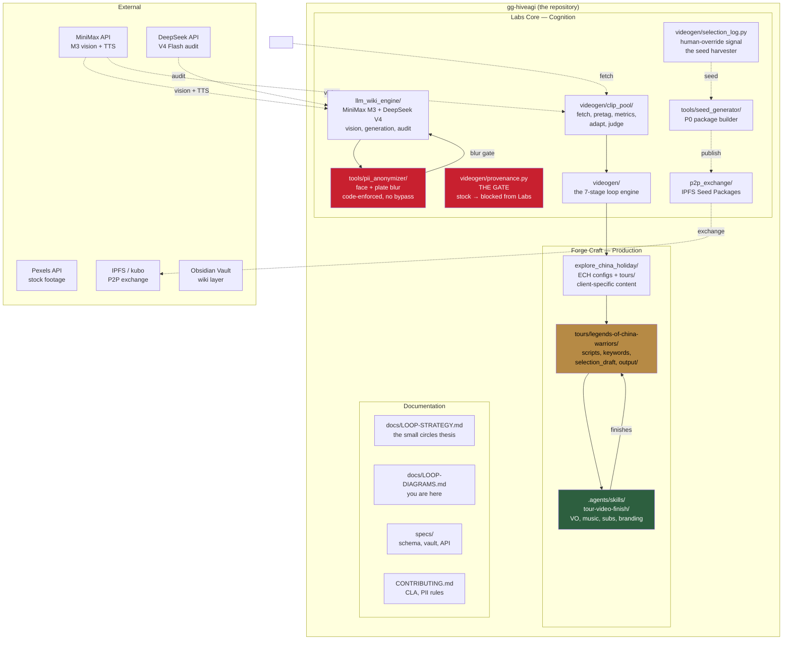

# The Loop Diagrams — How Project Hive.AGI Actually Gets Built

> Visual map of the "small circles" strategy (see `LOOP-STRATEGY.md`).
> Each circle is a complete, reviewable loop. They overlap, they feed
> each other, and together they cover the vision.

---

## Diagram 1 — One Small Circle (the shape every loop shares)

Every circle — no matter the domain — runs the same 7 stages. Finish all 7,
or the circle isn't complete.

**The two outputs of every circle:**
- 🎬 **Deliverable** (right) — the commercial video. Ephemeral. Sells a tour.
- 🌱 **Seed** (below) — the human judgments. Durable. Feeds Labs. The asset.

---

## Diagram 2 — The Provenance Seam (what crosses, what doesn't)

This is the load-bearing boundary. Get it wrong and the AGI thesis corrupts.

**The hybrid seed insight:** Stock *pixels* are blocked from Labs. But human
*judgments* about stock (the beauty standard) ARE Labs-eligible — tagged so
Labs can tell "editor taste on professional footage" from "human capture."

---

## Diagram 3 — Circle #1 (Legends of China Warriors) — COMPLETE

The first circle, fully run. Every stage has a concrete artifact.

**Status:** Draft 1 assembled. Subtitles + end card rendered. VO + music
pending (MiniMax TTS built, music to source). The circle is *reviewable* —
every decision traceable, every clip provenance-tagged.

---

## Diagram 4 — Multiple Circles Overlapping (the coverage strategy)

Each circle is a complete loop in a new domain. They reuse infrastructure,
overlap in capability, and together approach full coverage of the vision.

**What each circle adds:**
- Circle 1 (done): the loop itself + tourism beauty standard
- Circle 2: new audience (over-60s), new tour geography
- Circle 3: new region (Silk Road), new "beauty" definition
- Circle N: new domain entirely (same loop shape, new content)
- Circle M: **the inflection** — source flips from stock to glasses-captured.
  Now raw pixels are ALSO Labs-eligible. The infrastructure doesn't change.

---

## Diagram 5 — How Requests, Projects, and Loops Link Together

A single request ("make a tour video") triggers a loop. A project (ECH) runs
many loops. The Labs vision aggregates seeds from all projects.

**The value loop:**
1. A request triggers a loop → produces a commercial deliverable (Forge revenue)
2. The same loop captures human judgments → deposits seed (Labs asset)
3. Labs research on aggregated seeds → better tools → better Forge deliverables
4. Better Forge output → more clients → more loops → more seed → coverage grows

**Commercial funds research. Research makes commercial better. The loop compounds.**

---

## Diagram 6 — The Full System Architecture (where everything lives)

---

## How to read these diagrams together

| Diagram | Answers |
|:---|:---|
| **1 — One Small Circle** | What does a complete loop look like? (the 7 stages) |
| **2 — Provenance Seam** | What crosses from Forge to Labs, and what's blocked? |
| **3 — Circle #1** | What did the Legends tour actually produce? (concrete artifacts) |
| **4 — Multiple Circles** | How do circles overlap and cover the vision? |
| **5 — Requests/Projects/Loops** | How does a request become a loop, and how do loops link? |
| **6 — System Architecture** | Where does every piece of code live in the repo? |

The thesis in one line: **finish one complete circle, review it, run the next.
Same shape every time. Overlapping coverage approaches 99.9%.**

Circle #1 is done. Circle #2 starts when you say go.
